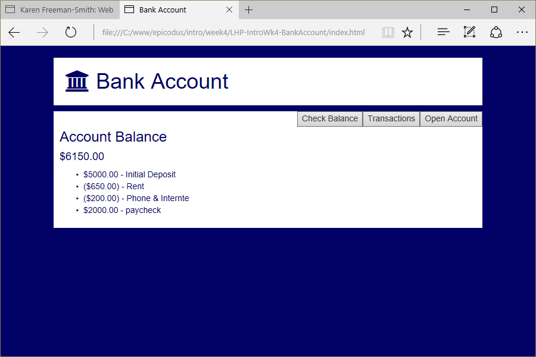

# Bank Account
Version 0.0.1: May 3, 2016
by [Karen Freeman-Smith](https://karenfreemansmith.github.io)

### Technologies Used
HTML, CSS, Bootstrap, JavaScript, jQuery

## Description
*[Learn How To Program](http://learnhowtoprogram.com) Intro to Programming Week 4 Individual Project: A webpage that keeps track of your bank account.*

## Setup/Installation
* [View on Github Pages](https://karenfreemansmith.github.io/LHP-IntroWk4-BankAccount)
* _OR_
* Clone directory
* Open index.html in your favorite browser

## Support & Contact
For questions, concerns, or suggestions please email karenfreemansmith@gmail.com

## Specifications
Use constructor functions and prototypes to create a webpage where a user can create a single bank account with an initial deposit amount. Then allow the user to make a withdrawals, deposits and see the balance of the account.

Remember to create a BankAccount constructor and a prototype that includes methods for deposit and withdrawal and any other properties needed.

## Known Issues
* None

## Legal
*Licensed under the GNU General Public License v3.0*

Copyright (c) 2016 Copyright _[Karen Freeman-Smith](https://karenfreemansmith.github.io)_ All Rights Reserved.
